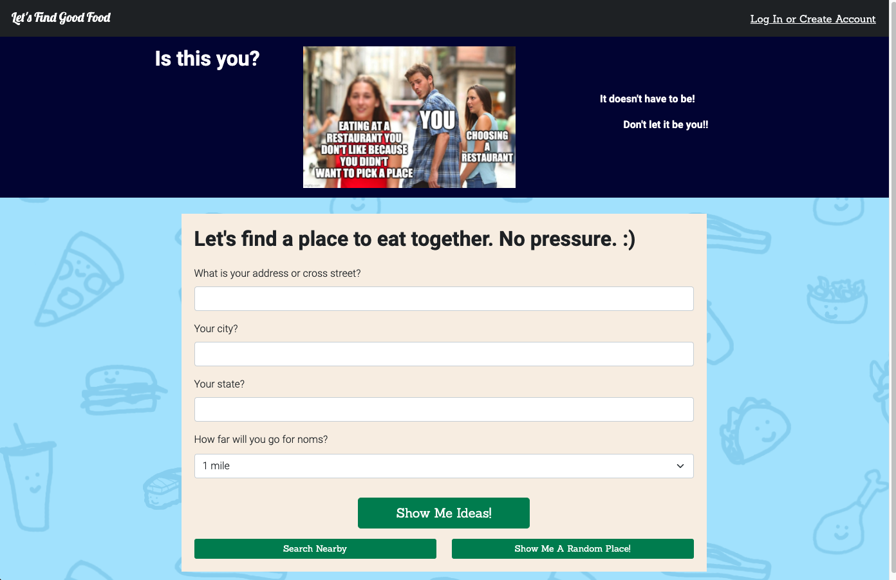
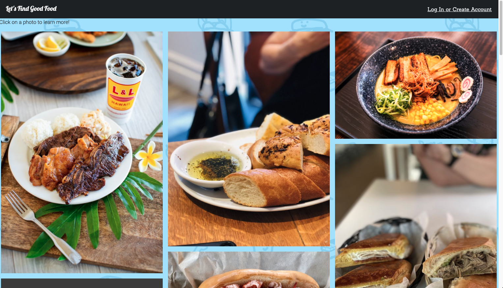
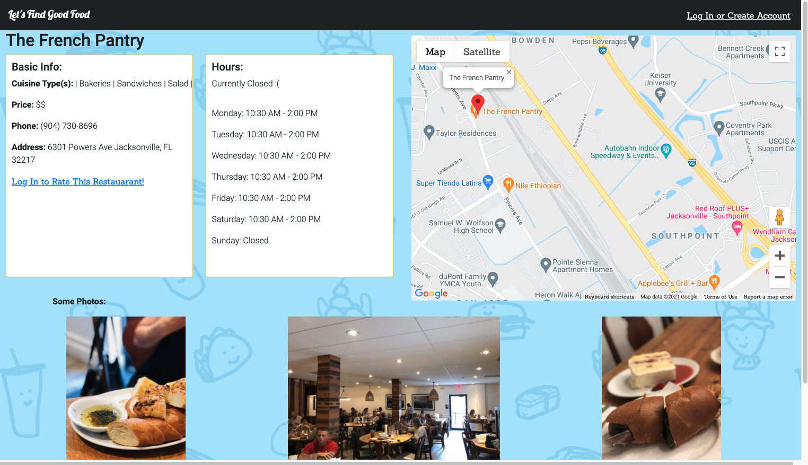
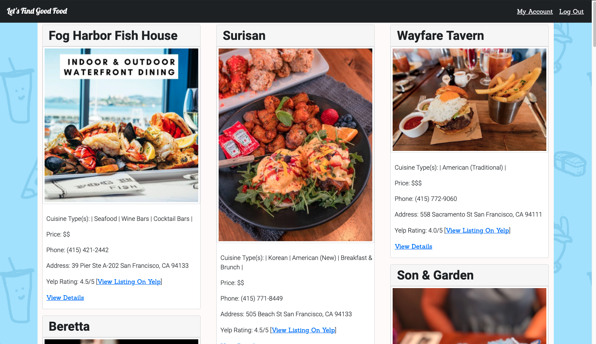
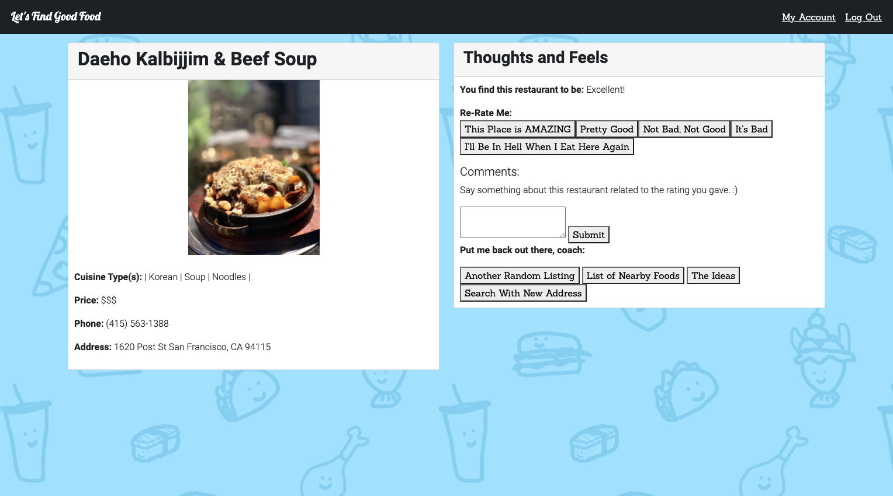

# Let's Find Good Food

The website is designed to use strong visuals to help indecisive people decide where they want to eat. It should show a user pictures of food for ease of decision. The website features the following: a login/logout system, several pages to view restaurant options, a way to rate them, a way to leave a comment on a restaurant, a way to view rated restaurants.

Ways in which a user can view restaurants:
1. **Ideas** - Shows a user photos of nearby restaurants.
2. **Nearby** - Shows a user photos with names/descriptions of nearby restaurants.
3. **Random/Details** - Shows user a details page of a singular listing complete with hours and Google map.
4. **Rating** - Shows a user a place to rate and comment on a restaurant (login required).
5. **Login/Logout** - Allows a user to create a login and furthermore log in and log out of the webapp.
6. **Account** - Shows user their username and email. Shows user their rated restaurants with the rating and comment. 

## Tech Stack

**Tech Stack:**
Flask, FlaskLogin, SQLAlchemy, jQuery, Jinja, Bootstrap, Python, JavaScript, HTML, CSS

**APIs:**
Yelp, Google Maps JavaScript, Google Geocoding

## Images 

**Homepage**

**Ideas**

**Random/Details**

**Nearby**

**I Went Here (Rating)**

